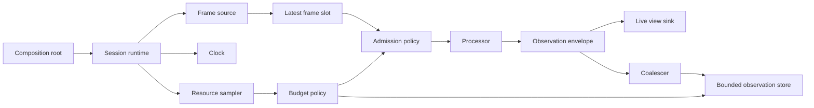

# Arquitectura neutral

Estado: `accepted` para infraestructura; el dominio del producto permanece bloqueado por escenarios.

## Vista general



El núcleo no conoce OpenCV, ONNX Runtime, SQLite ni una UI. Los adapters implementan puertos; el composition root los conecta manualmente.

## Componentes y ownership

| Componente | Responsabilidad exclusiva |
|---|---|
| `SessionRuntime` | Lifecycle, admisión y shutdown coordinado |
| `FrameSource` | Producir frames con tiempo y época |
| `CameraController` futuro | Handle de cámara y negociación del stream |
| `FrameBufferPool` | Buffers propiedad de Viskium |
| `ProcessorWorker` | Processor o sesión de inferencia |
| `ObservationWriter` | Conexión de escritura del store |
| `LiveViewSink` | Snapshot visible más reciente |
| `ResourceSampler` | Medición read-only del host y proceso |
| `BudgetPolicy` | Decisiones puras de perfil y admisión |

El processor no modifica cámara, UI o almacenamiento. La UI no abre la cámara. El sampler no degrada componentes por sí mismo.

## Contratos mínimos

### `FrameEnvelope`

```text
source_id
stream_epoch
sequence
source_timestamp opcional
received_monotonic_ns
timestamp_quality
width / height
pixel_format / stride
buffer_id / generation
quality_flags
payload efímero no serializable
```

`stream_epoch` cambia después de reconexión, cambio de modo o reanudación. Un payload que sobrevive al frame se copia como ROI o tensor compacto; una view no puede escapar del lease.

### `ProcessingRequest`

```text
request_id
processor_id / processor_version
source_id / stream_epoch / frame_sequence
created_monotonic_ns
deadline_monotonic_ns opcional
priority
supersedes_key opcional
roi opcional
config_fingerprint
```

### `ObservationEnvelope`

```text
session_id
source_id / stream_epoch / source_sequence
observed_monotonic_ns
wall_utc opcional
producer_id / producer_version
schema_id / schema_version
payload validado y limitado
quality o confidence opcional
provenance
sensitivity_class
persistence_class
ttl
idempotency_key
trace_id
```

No admite frames, tensores, masks ni blobs arbitrarios. `unknown`, `absent` y `false` son estados distintos.

### `PersistenceReceipt`

```text
accepted | coalesced | rejected | gap | failed
reason
store_sequence opcional
bytes_accepted
```

### `HealthEvent`

```text
component
state
reason_code
first_seen / last_seen
count
recoverable
user_action opcional
```

Los errores repetidos se agregan; no producen un evento en disco por frame.

## Concurrencia inicial

```text
capture thread
    ↓
latest-frame slot
    ↓
runtime coordinator
    ↓
one processor worker
    ↓
bounded observation queue
    ↓
one store writer
```

- Un proceso inicialmente.
- Una inferencia pesada en vuelo.
- Threads antes que procesos.
- `asyncio` solo cuando aparezca I/O concurrente real.
- Ninguna cola ilimitada; límite por count y bytes.
- Los trabajos pendientes pueden fusionarse o expirar.
- Un trabajo nativo ya iniciado puede ser no cancelable; su resultado se valida al volver.
- Captura se aísla en otro proceso solo si una prueba demuestra que `read()` no termina dentro del deadline.

## Validez temporal

Una inferencia tardía no se acepta o rechaza únicamente por `state_revision`. Se evalúan:

- `stream_epoch`.
- Secuencia y momento de captura.
- Deadline y edad.
- Entidad o campo afectado.
- Evidencia posterior contradictoria.
- Posibilidad de fusionar el resultado sin retroceder estado.

La revisión sirve como procedencia. Esto evita que un processor lento trabaje para que todos sus resultados sean descartados automáticamente.

## Modos de ejecución

### Live

- Latest-frame y frescura prioritaria.
- Backpressure y drops contabilizados.
- Heartbeat aun si el gate barato no detecta cambios.
- Estado `STALE` al superar TTL.

### Replay exhaustive

- Procesa todas las entradas.
- Reloj virtual y seeds fijadas.
- Referencia algorítmica.

### Replay faithful

- Reproduce timestamps, jitter, reconexiones, drops, deadlines y decisiones de admisión.
- Referencia operacional del modo live.

Los modos comparten contratos y processor, no necesariamente clock o admission policy.

## Estructura objetivo

Se crean carpetas solo al aparecer su primera implementación real.

```text
src/viskium/
├── app.py
├── cli.py
├── config.py
├── paths.py
├── core/
├── runtime/
├── capture/
├── processing/
├── observations/
├── storage/
├── resources/
├── observability/
└── adapters/

tests/
├── unit/
├── property/
├── contract/
├── replay/
├── integration/
├── faults/
├── perf/
└── hardware/
```

No habrá inicialmente módulos `belief`, `world`, `graph`, `planner`, `agents` o `dynamics`.
