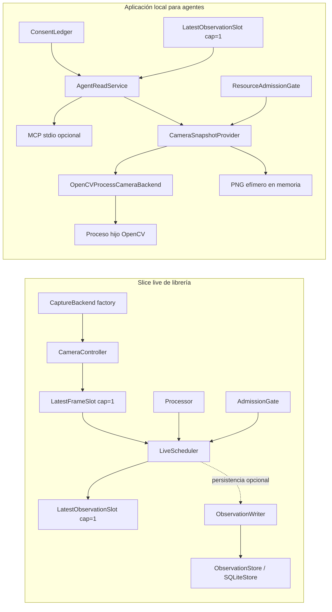

# Arquitectura implementada

Estado: `accepted` para los slices fundacionales. El dominio del producto, un processor real y una
vista semántica permanecen bloqueados por escenarios. Ningún componente está desplegado.

## Qué existe hoy

Viskium contiene dos caminos relacionados, pero todavía no una única aplicación continua de visión:

1. Un slice live de librería: captura latest-only, un processor, publicación de la observación más
   reciente y persistencia opcional acotada.
2. Un prototipo local para agentes: status, lectura de una observación ya disponible y un snapshot
   de cámara one-shot bajo consentimiento.



`build_agent_application()` compone el segundo camino sin abrir la cámara. Su
`LatestObservationSlot` no tiene actualmente un productor conectado: `agent serve` puede exponer
status y snapshots one-shot, pero no inicia `CameraController`, `LiveScheduler`, un processor ni
SQLite. Integrar ambos caminos exige un composition root adicional y pruebas E2E.

## Componentes y ownership

| Componente | Responsabilidad y límite de ownership |
|---|---|
| `CameraController` | Crea, abre, lee y cierra un backend en un único daemon thread. Nunca crea el siguiente backend antes de que cierre el anterior. |
| `CaptureBackend` | Negocia un stream y devuelve resultados tipados dentro de deadlines. El acceso pertenece a un solo thread. |
| `OpenCVProcessCameraBackend` | Aloja OpenCV y el handle físico en un proceso hijo. Ante timeout termina ese worker antes de reutilizar el backend. |
| `LatestFrameSlot` | Retiene como máximo un `FrameEnvelope`; un offer nuevo reemplaza el pendiente y `close()` lo descarta. |
| `LiveScheduler` | Posee un processor worker, valida frescura/epoch/identidad y publica como máximo la última observación. |
| `LatestObservationSlot` | Retiene una observación estructurada, con reads acotados por edad, espera y schemas; no conserva historial para buscar una coincidencia anterior. |
| `ObservationWriter` | Crea, usa y cierra un store en un único daemon thread; su cola está limitada por count y bytes canónicos. |
| `SQLiteStore` | Pertenece a un thread, usa journal `DELETE` y aplica límites de filas, payload, DB, queries y purga. |
| `ResourceSampler` | Mide RSS, memoria disponible y espacio del volumen sin escribir ni tomar decisiones. |
| `BudgetPolicy` | Produce decisiones puras de captura, procesamiento y persistencia. |
| `ResourceAdmissionGate` | Cachea brevemente solo el snapshot de recursos y reaplica cada estimación de bytes. |
| `ConsentLedger` | Persiste el grant local y su cuota sin guardar bearer tokens ni abrir hardware. |
| `AgentReadService` | Autoriza y acota status, una observación latest o un snapshot; revalida el grant después de esperar/capturar. |
| `CameraSnapshotProvider` | Serializa una operación one-shot: admission, open, warmup/read, PNG en RAM y close. No cachea frames ni resultados. |
| Transporte MCP | Adapta cinco operaciones versionadas; challenge sintético sin consentimiento más lecturas acotadas; no transmite video ni controla el lifecycle de cámara. |

El processor no modifica cámara, consentimiento o almacenamiento. El sampler no degrada componentes
por sí mismo. El servicio para agentes no crea ni renueva grants.

## Contratos implementados

### `FrameEnvelope`

```text
source_id / stream_epoch / sequence
received_monotonic_ns / source_timestamp_ns opcional / timestamp_quality
width / height / pixel_format / stride
buffer_id / generation / quality_flags
payload efímero como bytes inmutables
```

La implementación actual copia el frame a `bytes`; no existe todavía un buffer pool ni un contrato de
leases. El payload puede estar en el stack de captura, en un slot de capacidad uno o durante una
operación one-shot, y no forma parte de la serialización de observaciones.

### `ObservationEnvelope`

```text
session_id / source_id / stream_epoch / source_sequence
observed_monotonic_ns / wall_utc opcional
producer_id / producer_version
schema_id / schema_version
payload JSON-shaped copiado y congelado en profundidad
confidence / provenance
sensitivity_class / persistence_class / ttl_ns
idempotency_key / trace_id
```

El payload admite solo valores JSON acotados, enteros signed 64-bit y floats finitos. No admite frames,
tensores, masks ni blobs arbitrarios. `prohibited` nunca se publica por el scheduler ni se persiste;
`visual` no se admite en SQLite.

### `PersistenceReceipt`

```text
accepted | coalesced | rejected | gap | failed
reason opcional
store_sequence opcional
bytes_accepted
```

Una submission al writer significa `queued`, no durabilidad. La durabilidad solo se refleja cuando el
store devuelve su receipt. El límite de bytes del writer usa tamaño canónico, no RSS exacto, y una
observación ya `in_flight` se reporta fuera de la cola.

### Captura y snapshot

`CaptureRequest`, `CameraPolicy`, `CaptureCapabilities`, `NegotiatedStream`, `BackendFrame` y
`CaptureRead` forman un contrato tipado y acotado. `SnapshotEnvelope` contiene únicamente PNG
inmutable, dimensiones, procedencia mínima y sensitivity class; no contiene metadatos de cámara
adicionales ni se escribe automáticamente.

### Agente local

`ConsentGrant` solo contiene id público, scopes, expiración, cuota y sensitivity ceiling. Los límites
de requests, metadata, observaciones, PNG, borde, espera, edad y schemas se publican en
`AgentLimits`. Ninguna credencial aparece en inputs o resultados model-visible.

## Concurrencia y backpressure

```text
CameraController owner thread
    ↓ offer no bloqueante
LatestFrameSlot (1)
    ↓ take acotado
LiveScheduler processor thread
    ↓ offer latest-only
LatestObservationSlot (1)
    ↓ submit opcional no bloqueante
ObservationWriter queue (count + bytes)
    ↓ un owner thread
ObservationStore / SQLiteStore
```

- No hay colas ilimitadas.
- Solo hay una llamada al processor por scheduler.
- Los frames pendientes obsoletos se reemplazan en vez de acumularse.
- El scheduler rechaza frames futuros, viejos o de otra epoch y resultados tardíos o con identidad
  incoherente.
- Un processor nativo no cooperativo no puede terminarse con seguridad desde un thread; el shutdown
  acotado deja el scheduler en `STUCK`.
- El backend OpenCV usa un proceso precisamente para poder terminar open/read que excedan su
  deadline; falta demostrarlo con hardware real.
- El writer puede drenar o descartar explícitamente al cerrar; si `put()` no coopera, queda `STUCK`.

El camino one-shot no usa una cola: un lock no bloqueante rechaza concurrencia como `busy`, un
cooldown evita reaperturas rápidas y una sola deadline cubre open, warmup, reads y encoding.

## Modos de ejecución

### Live de librería

Prioriza frescura mediante latest-only, deadlines, epoch y backpressure. Está validado con fuentes y
processors falsos, pero aún no tiene un composition root continuo público ni hardware caracterizado.

### Replay exhaustive

Procesa todas las entradas con reloj virtual y resultados deterministas.

### Replay faithful sintético

Reproduce la política latest-only sobre timestamps sintéticos. No afirma todavía paridad completa con
jitter, drivers o reconexiones de una cámara física.

### Agente one-shot

El transporte MCP opcional expone exactamente cinco tools, separadas en tres
lecturas/capturas de cámara y dos operaciones sintéticas de challenge:

Herramientas de cámara/lectura:

- `viskium_status_v1`: status público acotado, sin consentimiento ni hardware.
- `viskium_latest_observation_v1`: como máximo una observación bajo grant existente.
- `viskium_snapshot_v1`: como máximo un PNG one-shot bajo grant y cuota existentes.

Herramientas sintéticas de challenge:

- `viskium_vision_challenge_v1`: emite una imagen sintética y un recibo efímero.
- `viskium_verify_vision_challenge_v1`: verifica los claims contra ese challenge.

No existe tool para conceder acceso, abrir una sesión continua, mover una cámara o guardar imágenes.
Las pruebas de software recorren grant, admission, cliente MCP in-memory y cierre del worker con
dobles; la validación física queda opt-in y separada de CI. Sigue faltando caracterización
multi-dispositivo, unplug/busy/sleep-resume y cliente stdio externo con hardware.

## Estructura actual

```text
src/viskium/
├── app.py
├── cli.py
├── config.py
├── paths.py
├── core/
├── capture/
├── runtime/
├── observations/
├── snapshots/
├── storage/
├── resources/
├── agent/
└── adapters/

tests/
├── unit/
├── property/
├── contract/
├── replay/
└── integration/
```

No existen todavía módulos de producto como `belief`, `world`, `graph`, `planner` o `dynamics`.
Tampoco existen un processor de visión real, UI semántica, fuente telefónica o servicio desplegado.
