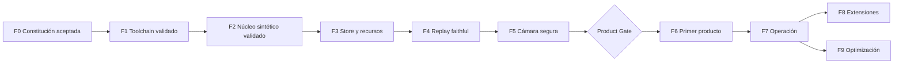

# Plan maestro de Viskium

Estado: F0 `accepted`; F1 y F2 `prototyped` y `validated` en el entorno de desarrollo actual;
F3 en adelante permanecen `planned` y las fases de producto siguen condicionadas por Product
Gate. No existe ninguna capacidad `deployed`.

## Estrategia general

Viskium se desarrolla mediante cortes verticales pequeños. Cada fase entrega una ruta ejecutable y medible; no se crean carpetas o frameworks para capacidades futuras.



## F0 — Constitución e identidad

Entregables:

- Nombre, package, schema y data root.
- Constitución.
- Arquitectura neutral.
- Registro adversarial.
- Política de datos y recursos.
- Capability matrix.
- ADR inicial.

Gate:

- Ninguna contradicción abierta.
- Toda incertidumbre tiene estado y gate.
- No se afirma que el producto esté definido.

Estado: `accepted`. La identidad y los límites fundacionales ya gobiernan la implementación; las
decisiones de producto continúan deliberadamente abiertas.

## F1 — Bootstrap reproducible

Vertical slice:

```text
checkout limpio
→ entorno locked
→ build wheel
→ instalación limpia
→ doctor read-only
→ test suite
```

Decisiones implementadas:

- `pyproject.toml`, layout `src` y backend simple.
- Python 3.13 como minor soportada (`>=3.13,<3.14`).
- `uv` y `uv.lock`.
- Ruff.
- Un type checker.
- pytest, Hypothesis y branch coverage.
- Config TOML validada.
- `VISKIUM_DATA_ROOT` y path preflight.

Gate y evidencia:

- Validado localmente: wheel instalable fuera del repo.
- Validado localmente: `doctor` no abre ni modifica la cámara.
- Validado localmente: configuración y diagnóstico no crean la raíz de datos.
- Pendiente de evidencia remota: paridad básica Ubuntu/Windows en CI pública.
- No existe publicación de paquete configurada.

Estado: `prototyped` y `validated` en el entorno de desarrollo actual. El wheel se construye e
instala de forma aislada; `doctor` y `config` son read-only. La suite fundacional completa reporta
la suite completa y el gate de branch coverage. El workflow Ubuntu/Windows está definido, pero
cada ejecución de CI seguirá siendo evidencia independiente y no se sustituye con este resultado
local.

## F2 — Núcleo determinista

Vertical slice:

```text
SyntheticSource
→ DeterministicProcessor
→ ObservationEnvelope
→ InMemoryStore
→ salida textual/semántica mínima
```

Incluye:

- Contratos y schemas v1.
- Clock falso.
- Lifecycle y shutdown.
- Replay exhaustive.
- Baseline mínimo de replay faithful con reemplazo determinista de trabajo pendiente obsoleto.
- Contract tests para source, processor y store.
- Property tests para secuencias, determinismo, idempotencia y payloads JSON canónicos.
- Los leases pertenecen a F5 y no se simulan como capacidad existente en F2.

Gate:

- Misma entrada y seed producen mismo resultado.
- Ningún thread o handle queda vivo.
- Ningún concepto de producto entra al core.
- La salida mínima deriva de observaciones sintéticas, no de una cámara.

Estado: `prototyped` y `validated` para el slice sintético. Existen contratos v1, reloj virtual,
`SyntheticSource`, `DeterministicProcessor`, `MemoryStore` acotado y salida JSON/textual por CLI.
Las pruebas cubren determinismo, lifecycle, límites por cantidad/bytes, idempotencia, configuración
y ambos modos de replay. Esta validación no incluye vídeo, modelos, SQLite ni hardware.

## F3 — Persistencia y presupuestos

Estado: `planned`; no existe SQLite ni persistencia en disco implementada.

Vertical slice:

```text
replay
→ coalescer
→ bounded SQLite writer
→ retention
→ query
→ health/resource report
```

Incluye:

- Modos `disabled`, `best_effort_bounded` y `required`.
- Store SQLite con journal convencional y un writer.
- Quotas por clase y reserva del volumen.
- Logs agregados y rotatorios.
- ResourceSampler + BudgetPolicy.
- Faults de full, permissions, lock, corruption y log storm.

Gate:

- Disco lleno simulado no llena RAM.
- La cuota incluye archivos auxiliares.
- DB corrupta se preserva y pone en cuarentena.
- `required` y `best_effort_bounded` tienen resultados distintos y explícitos.
- Soak sintético sin crecimiento monotónico no explicado.

## F4 — Tiempo, admisión y replay faithful

Estado: `planned` con un baseline parcial ya validado en F2. El modo faithful actual demuestra de
forma sintética y determinista el reemplazo de trabajo pendiente; todavía no implementa el
scheduler temporal completo, deadlines, cancelación general ni validez de resultados tardíos.

Vertical slice:

```text
fixture temporal
→ admission/deadlines/drops
→ processor lento
→ validity policy
→ observaciones
```

Incluye:

- Replay faithful.
- Latest-frame.
- Coalescing/cancelación de jobs pendientes.
- Resultados tardíos por epoch, edad, campo y evidencia.
- Métricas de frame age y drop reason.

Gate:

- Faithful reproduce decisiones de live.
- Un processor 10× lento no hace crecer RAM.
- La revisión vieja no es el único criterio de rechazo.
- Shutdown tiene deadlines.

## F5 — Caracterización y captura segura

Estado: `planned`; no se ha abierto ni caracterizado ninguna cámara.

La cámara real se usa únicamente con autorización explícita y pruebas hardware opt-in.

Vertical slice:

```text
CameraController
→ buffers propios + lease/latest
→ processor determinista barato
→ live view
→ observación opcional
→ store
```

Incluye:

- Un handle.
- Lifecycle y cooldown.
- Nuevo epoch tras reconexión.
- Comparación de backends y modos realmente disponibles.
- Frame age, FPS real, copies, RSS y tiempo de cierre.
- Cero controles ópticos y vendor-specific en baseline.

Gate:

- Sin use-after-recycle.
- Unplug, camera busy y sleep/resume resueltos.
- Cierre idempotente.
- Ningún frame crudo persistido.
- Sin retry loop ni handle leak.
- Si `read()` no termina, se decide aislamiento del adapter.

## Product Gate — antes del primer modelo

Se requieren tres escenarios. Cada uno especifica:

```text
entrada
salida visible
evento mínimo
latencia/frescura
costo de omisión/invención/retraso
persistencia y TTL
sensibilidad
jornada y background
```

Este gate decide:

- Ontología.
- Preview crudo/semántico/híbrido.
- Resolución, FPS y color.
- Sampling y heartbeat.
- Política durability versus realtime.
- Tipo y número de processors/modelos.
- Soak mínimo real.

## F6 — Primer corte de producto

Estado: bloqueado por Product Gate; no se ha seleccionado ni ejecutado ningún modelo.

- Un solo escenario prioritario.
- Baseline determinista o CV simple.
- Un solo processor/modelo candidato.
- Manifiesto con hash, licencia, inputs/outputs y preprocess.
- Vista semántica determinista.
- Fixtures representativos y negativos.
- Bake-off precisión/latencia/RSS/CPU/escrituras.

Gate:

- El modelo supera o justifica su coste frente al baseline.
- Precisión y calibración aceptadas.
- p95/p99, frame age y memoria dentro del hardware profile.
- Fallos, privacidad y licencias cerrados.

## F7 — Endurecimiento operativo

- Soaks dimensionados por jornada real.
- Recovery y migraciones.
- UX de health, stale, gaps, cuota y borrado.
- Runbooks.
- Packaging local.
- Capability matrix honesta.
- SBOM y revisión de dependencias.

Gate:

- Release local candidata sin gates críticos pendientes.
- Recovery probado.
- Métricas estables por hardware profile.

## F8 — Extensiones condicionadas

Teléfono, red, audio, nube, múltiples cámaras, modelos adicionales o UI compleja requieren cada uno:

- Escenario aprobado.
- ADR.
- Threat model.
- Presupuesto.
- Contratos.
- Corte vertical y rollback.

El teléfono será una fuente remota con encoder, jitter buffer, timestamps, clock uncertainty, pairing, autenticación, cifrado, batería y política térmica.

## F9 — Optimización avanzada

Solo después de profiling:

- INT8.
- OpenVINO u otro backend.
- Pools y arenas ajustados.
- Multiprocessing.
- Shared memory.
- Segmentación de SQLite.
- Rust/PyO3.

Gate para Rust:

1. Contrato estable.
2. Implementación Python correcta y golden.
3. Hot path representa aproximadamente 20% o más del E2E.
4. Algoritmo, frecuencia y vectorización ya optimizados.
5. Ganancia material contando copias.
6. Paridad y reversión sencillas.

## Estrategia de pruebas

| Nivel | Propósito |
|---|---|
| Unit | Policies, lifecycle, coalescing, validez, retención |
| Property | Secuencias, idempotencia, TTL/cuota, leases, overflow |
| Contract | Todas las implementaciones de source/processor/store |
| Replay | Exhaustive y faithful con goldens separados |
| Integration | Slice completo con fakes |
| Fault | Full, permissions, lock, corruption, timeout, stale |
| Perf | p50/p95/p99, frame age, RSS, writes y queues |
| Hardware | Cámara real opt-in, lifecycle y backends |

CI por PR no incluye cámara ni timing frágil. Benchmarks y hardware usan runners identificados y baselines propios.

Baseline validado actual: la suite F1/F2 supera el gate de 90% de branch coverage. Esa evidencia no
incluye todavía suites de SQLite, faults de disco, rendimiento, soak, cámara o modelos, por lo que
no puede usarse como evidencia de esas fases.

## Flujo de desarrollo

```text
escenario o riesgo
→ contrato
→ clasificación
→ presupuesto
→ failure modes
→ test que falla
→ corte mínimo
→ medición
→ revisión adversarial
→ ADR si corresponde
→ promoción de capability
```

PRs pequeñas y verticales. Nada entra al camino live solo porque “podría servir después”.

## ADR futuros obligatorios

- Nueva frontera o dependencia pesada.
- Cambio de schema o persistencia.
- Nuevo dato sensible.
- Nueva fuente física o remota.
- Red o nube.
- Cambio de concurrencia.
- Optimización nativa.
- Cambio de retención.
- Activación de WAL.
- Primer modelo y cada familia de modelo adicional.
